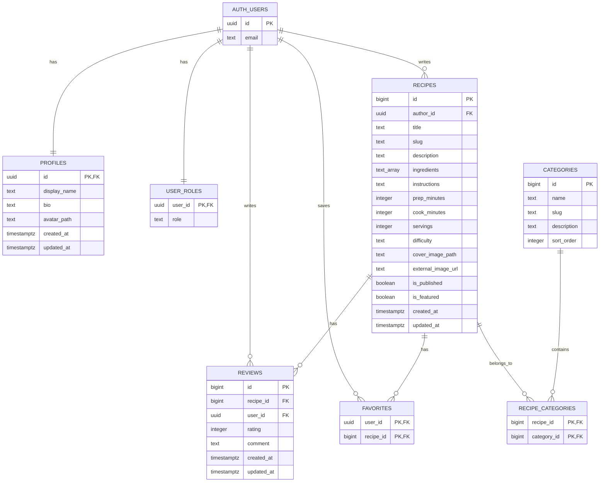

# Вкусно.bg

Multi-page кулинарен портал на български език. Приложението позволява разглеждане на рецепти, търсене и филтриране по категории, регистрация и вход, добавяне и редакция на рецепти, профилна страница, оценки с коментари и базов admin panel.

Проектът е вдъхновен от структурата на български рецептурни сайтове, но използва оригинален UI, оригинални примерни данни и собствена архитектура.

## Technologies

- Vite
- Vanilla JavaScript ES modules
- HTML и CSS
- Bootstrap 5
- Bootstrap Icons
- Supabase Auth
- Supabase Postgres
- Supabase Storage
- Supabase Row Level Security

## Screens / Pages

- `index.html` - начална страница с категории, търсене, нови рецепти и популярни рецепти.
- `recipe.html` - детайлна страница за рецепта по `slug`, с продукти, инструкции, рейтинг и коментари.
- `recipe-form.html` - форма за добавяне, редакция и изтриване на рецепти.
- `login.html` - вход със Supabase Auth.
- `register.html` - регистрация със създаване на профил и user роля.
- `profile.html` - профил, avatar upload, bio и списък с мои рецепти.
- `admin.html` - admin panel за роли, рецепти и категории.

## Architecture

Приложението е без React, Vue и TypeScript. Всеки HTML файл е отделен Vite entry point, конфигуриран във `vite.config.js`.

Основната JavaScript логика е в `src/main.js`, а достъпът до Supabase е отделен в service слой:

- `src/config/supabase.js` - Supabase client, env проверка и helper за public storage URL.
- `src/services/authService.js` - login, register, logout, профили и navbar auth state.
- `src/services/recipeService.js` - категории, рецепти, reviews, slug generation и CRUD операции.
- `src/services/storageService.js` - upload към `avatars` и `recipe-images`.
- `src/services/adminService.js` - admin dashboard заявки и admin операции.
- `src/components/recipeCard.js` - reusable card renderer за рецепти.

## Database Schema Summary

Основните таблици са:

- `profiles` - публична профилна информация за потребители: име, bio, avatar path и timestamps.
- `user_roles` - роля на потребител: `user` или `admin`.
- `categories` - категории с име, slug, описание и ред на сортиране.
- `recipes` - рецепти с автор, title, slug, описание, продукти, инструкции, време, порции, трудност, снимка и publish/featured flags.
- `recipe_categories` - many-to-many връзка между рецепти и категории.
- `favorites` - любими рецепти по потребител.
- `reviews` - оценки и коментари, като един потребител има една оценка за една рецепта.

Има индекси за foreign keys и чести заявки, trigger за `updated_at`, както и helper функции в `private` schema.

## Database Schema Diagram



## Supabase Migrations Workflow

Локалните миграции са в `supabase/migrations`.

Текущият ред е:

- `001_create_vkusno_schema.sql`
- `002_auth_registration_policies.sql`
- `003_create_auth_user_profile_trigger.sql`
- `004_recipe_reviews_policies.sql`
- `005_recipe_crud_policies.sql`
- `006_recipe_category_policy_helper.sql`
- `007_profile_storage_policies.sql`
- `008_add_rls_and_storage_policies.sql`
- `009_remove_public_storage_listing_policies.sql`
- `010_security_refinements.sql`

При нова промяна в базата:

1. Създай нов SQL файл със следващ номер в `supabase/migrations`.
2. Пиши само идемпотентни или ясно приложими DDL промени.
3. Приложи миграцията през Supabase MCP или Supabase CLI.
4. Пусни security и performance advisors.
5. Ако има реални warning-и, добави нова миграция за поправка.

Seed данните са в `supabase/seed.sql` и съдържат оригинални български категории, рецепти, reviews и favorites.

## Local Setup

Инсталиране на dependencies:

```bash
npm install
```

Създай `.env` файл по примера от `.env.example`:

```env
VITE_APP_NAME="Вкусно"
VITE_API_URL="http://localhost:3000"
VITE_SUPABASE_URL="https://your-project-ref.supabase.co"
VITE_SUPABASE_PUBLISHABLE_KEY="your-publishable-key"
```

Стартиране в development режим:

```bash
npm run dev
```

Production build:

```bash
npm run build
```

Preview на build:

```bash
npm run preview
```

## Demo Credentials

Seed файлът очаква тези Supabase Auth потребители да съществуват:

- `demo@example.com` - обикновен потребител.
- `admin@example.com` - admin потребител.
- `test@test.com` - обикновен тестов потребител.

Паролите не се съхраняват в проекта. Създай потребителите и паролите им през Supabase Dashboard -> Authentication -> Users, след което изпълни `supabase/seed.sql`.

## Deployment Instructions

1. Създай Supabase проект.
2. Приложи миграциите от `supabase/migrations` в правилния ред.
3. Създай Auth demo users, ако ще използваш seed данните.
4. Изпълни `supabase/seed.sql`.
5. Създай Storage buckets:
   - `avatars`
   - `recipe-images`
6. Настрой production env променливите:
   - `VITE_SUPABASE_URL`
   - `VITE_SUPABASE_PUBLISHABLE_KEY`
7. Изпълни `npm run build`.
8. Deploy-ни съдържанието на `dist` във Vercel, Netlify, GitHub Pages или друг static hosting.

## Admin Capabilities

Admin достъпът се определя от `public.user_roles`, не от user metadata.

Admin panel-ът позволява:

- преглед на потребители;
- смяна на роля `user` / `admin`;
- преглед на рецепти;
- toggle на `is_published`;
- toggle на `is_featured`;
- добавяне и редакция на категории;
- линк към редакция на рецепта.

Ако потребителят не е admin, `admin.html` показва warning съобщение на български.

## Storage Usage

Използват се два Supabase Storage bucket-а:

- `avatars` - профилни снимки.
- `recipe-images` - снимки на рецепти.

Upload path-овете започват с `auth.uid()` / текущия `user.id`, например:

```text
<user-id>/avatar-...
<user-id>/recipe-...
```

Frontend-ът използва само publishable key и public URL helper. `service_role` key не се използва и не трябва да се добавя във frontend код.

## Security / RLS

Всички public таблици са с включен Row Level Security.

Основни правила:

- Публичните потребители могат да четат категории и публикувани рецепти.
- Authenticated потребители могат да създават свои рецепти, reviews и favorites.
- Owner може да редактира и изтрива собствените си рецепти.
- Admin може да управлява рецепти, категории и роли.
- `user_roles` се използва за authorization.
- Не се използва `user_metadata` за authorization.
- Helper функциите са в `private` schema и имат фиксиран `search_path`.
- Няма публично изпълними `SECURITY DEFINER` функции в `public` schema.
- Storage upload policies ограничават upload-а до папка на текущия потребител.

## Project Notes

UI текстовете поддържат български и английски език чрез language switcher. Визията използва Bootstrap компоненти, responsive layout, кулинарни категории, cards, icons и портал-ориентирана структура.

---

# Vkusno.bg

A multi-page culinary portal in Bulgarian. The application allows users to browse recipes, search and filter by category, register and sign in, add and edit recipes, manage a profile page, leave ratings with comments, and use a basic admin panel.

The project is inspired by the structure of Bulgarian recipe websites, but it uses an original UI, original seed data, and its own application architecture.

## Technologies

- Vite
- Vanilla JavaScript ES modules
- HTML and CSS
- Bootstrap 5
- Bootstrap Icons
- Supabase Auth
- Supabase Postgres
- Supabase Storage
- Supabase Row Level Security

## Screens / Pages

- `index.html` - home page with categories, search, new recipes, and popular recipes.
- `recipe.html` - recipe detail page by `slug`, with ingredients, instructions, rating, and comments.
- `recipe-form.html` - form for creating, editing, and deleting recipes.
- `login.html` - sign in with Supabase Auth.
- `register.html` - registration with profile and user role creation.
- `profile.html` - user profile, avatar upload, bio, and list of the user's recipes.
- `admin.html` - admin panel for roles, recipes, and categories.

## Architecture

The application does not use React, Vue, or TypeScript. Each HTML file is a separate Vite entry point configured in `vite.config.js`.

The main JavaScript logic is in `src/main.js`, while Supabase access is separated into a service layer:

- `src/config/supabase.js` - Supabase client, env validation, and public storage URL helper.
- `src/services/authService.js` - login, register, logout, profiles, and navbar auth state.
- `src/services/recipeService.js` - categories, recipes, reviews, slug generation, and CRUD operations.
- `src/services/storageService.js` - uploads to `avatars` and `recipe-images`.
- `src/services/adminService.js` - admin dashboard queries and admin operations.
- `src/components/recipeCard.js` - reusable recipe card renderer.

## Database Schema Summary

Main tables:

- `profiles` - public user profile information: display name, bio, avatar path, and timestamps.
- `user_roles` - user role: `user` or `admin`.
- `categories` - recipe categories with name, slug, description, and sort order.
- `recipes` - recipes with author, title, slug, description, ingredients, instructions, time, servings, difficulty, image, and publish/featured flags.
- `recipe_categories` - many-to-many relationship between recipes and categories.
- `favorites` - favorite recipes by user.
- `reviews` - ratings and comments, with one review per user per recipe.

The schema includes indexes for foreign keys and common queries, an `updated_at` trigger, and helper functions in the `private` schema.

## Database Schema Diagram


## Supabase Migrations Workflow

Local migrations are stored in `supabase/migrations`.

Current order:

- `001_create_vkusno_schema.sql`
- `002_auth_registration_policies.sql`
- `003_create_auth_user_profile_trigger.sql`
- `004_recipe_reviews_policies.sql`
- `005_recipe_crud_policies.sql`
- `006_recipe_category_policy_helper.sql`
- `007_profile_storage_policies.sql`
- `008_add_rls_and_storage_policies.sql`
- `009_remove_public_storage_listing_policies.sql`
- `010_security_refinements.sql`

For a new database change:

1. Create a new SQL file with the next number in `supabase/migrations`.
2. Write only idempotent or clearly applicable DDL changes.
3. Apply the migration through Supabase MCP or Supabase CLI.
4. Run security and performance advisors.
5. If there are real warnings, add a new migration to fix them.

Seed data is stored in `supabase/seed.sql` and contains original Bulgarian categories, recipes, reviews, and favorites.

## Local Setup

Install dependencies:

```bash
npm install
```

Create a `.env` file based on `.env.example`:

```env
VITE_APP_NAME="Вкусно"
VITE_API_URL="http://localhost:3000"
VITE_SUPABASE_URL="https://your-project-ref.supabase.co"
VITE_SUPABASE_PUBLISHABLE_KEY="your-publishable-key"
```

Start development mode:

```bash
npm run dev
```

Production build:

```bash
npm run build
```

Preview the build:

```bash
npm run preview
```

## Demo Credentials

The seed file expects these Supabase Auth users to exist:

- `demo@example.com` - regular user.
- `admin@example.com` - admin user.
- `test@test.com` - regular test user.

Passwords are not stored in the project. Create the users and their passwords through Supabase Dashboard -> Authentication -> Users, then run `supabase/seed.sql`.

## Deployment Instructions

1. Create a Supabase project.
2. Apply the migrations from `supabase/migrations` in the correct order.
3. Create Auth demo users if you want to use the seed data.
4. Run `supabase/seed.sql`.
5. Create Storage buckets:
   - `avatars`
   - `recipe-images`
6. Configure production env variables:
   - `VITE_SUPABASE_URL`
   - `VITE_SUPABASE_PUBLISHABLE_KEY`
7. Run `npm run build`.
8. Deploy the contents of `dist` to Vercel, Netlify, GitHub Pages, or another static hosting provider.

## Admin Capabilities

Admin access is determined by `public.user_roles`, not by user metadata.

The admin panel allows:

- viewing users;
- changing role `user` / `admin`;
- viewing recipes;
- toggling `is_published`;
- toggling `is_featured`;
- adding and editing categories;
- opening a recipe edit link.

If the user is not an admin, `admin.html` shows a warning message in Bulgarian.

## Storage Usage

Two Supabase Storage buckets are used:

- `avatars` - profile images.
- `recipe-images` - recipe images.

Upload paths start with `auth.uid()` / the current `user.id`, for example:

```text
<user-id>/avatar-...
<user-id>/recipe-...
```

The frontend uses only the publishable key and the public URL helper. The `service_role` key is not used and must not be added to frontend code.

## Security / RLS

All public tables have Row Level Security enabled.

Main rules:

- Public users can read categories and published recipes.
- Authenticated users can create their own recipes, reviews, and favorites.
- Owners can update and delete their own recipes.
- Admins can manage recipes, categories, and roles.
- `user_roles` is used for authorization.
- `user_metadata` is not used for authorization.
- Helper functions are in the `private` schema and have a fixed `search_path`.
- There are no publicly executable `SECURITY DEFINER` functions in the `public` schema.
- Storage upload policies restrict uploads to the current user's folder.

## Project Notes

The UI supports Bulgarian and English through a language switcher. The visual style uses Bootstrap components, responsive layout, culinary categories, cards, icons, and a portal-oriented structure.
